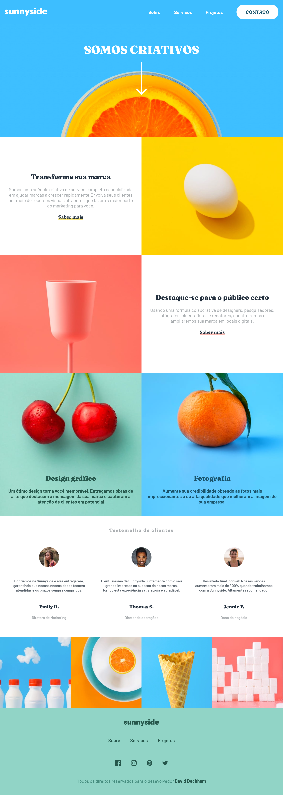

# Projeto Página de destino de agência

Este repositório contém uma projeto que foi inspirado em um dos exercícios do site [Frontend Mentor](https://www.frontendmentor.io/)

## Projeto

### Página de destino de agência

Este desafio será um teste perfeito para meu layout e habilidades responsivas. Há um pouquinho de JS para o menu móvel, mas o foco foi o HTML e CSS.

#### LINGUAGENS USADAS NESSE PROJETO.

- HTML
- CSS
- JavaScript

##### Exceções:

- NPM
- pacote Sass

## Como Usar
1. Abra o prompt de comando e escolha pasta que você quer adicionar o arquivo:
   **cd "caminho do local da pasta"**

2. Clone o repositório:
   git clone https://github.com/DavidMarinho2203/pagina-de-destino-da-agencia

3. Abra o arquivo `index.html` no seu navegador ou utilize uma extensão do VS Code como "Live Server" para ver o projeto em execução.

## Contato

Se você tiver alguma dúvida ou sugestão, sinta-se à vontade para entrar em contato:

- [LinkedIn](https://www.linkedin.com/in/david-beckham-278644227/)
- [Frontend Mentor](https://www.frontendmentor.io/profile/DavidMarinho2203)

---

Espero que você aproveite e que esse projeto seja útil para o você!
